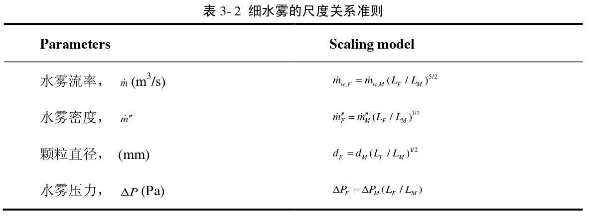
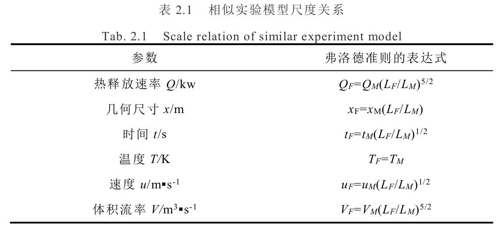

## 中庭火灾烟流相似模拟

> 近年来火灾相似模型主要有两类
>
> 1. 一类是Froude模型
> 2. 一类是压力（Pressure）模型
> 3. 还有一类模拟（analog）模型
>
> 压力模型需要控制压力，主要用于模拟可燃物的燃烧情景，在加压容器中进行。
>
> 而对于流动与传热问题，则应采用Froude模型，在常压下进行。
>
> 关键人物：Williams
>
> 关键文章：Scaling applications in fire research

## 地铁隧道列车火灾的火焰顶棚射流温度特性研究

> 1975年Heskestad在Williams的基础上,提出了简化的相似模型理论,提出了相似模型在不同火灾问题中的应用及所采用的模型律,并讨论了火焰羽流、建筑火灾的相似模型试验技术。这里可以去看看
>
> 

## 烟气控制条件下狭长空间烟气分层蔓延特性研究

> 1. 该文章是采用Froude 相似准则进行开展的。
>
> 2. 文中还给出了细水雾灭火的尺度准则

Froude 模型是基于火灾烟气的控制方程的无量纲 分析得到的。通过缩尺寸实验得到的结果与全尺寸实验的结果十分接近[3, 5]. 在 本研究中，不考虑材料的热惯性、辐射作用以及粘性作用对顶棚和墙壁的影响。

J.G. Quintiere [6] 提出了细水雾灭火的尺度准则，给出了无量纲的喷雾流率 和喷雾推力如下，
$$
m_{w, \text { supply }}^{*}=\frac{\dot{m}_{w, \text { supply }}}{\rho_{\infty} \sqrt{g }H^{5 / 2}}
$$

$$
\hat{F}=F / \rho_{\infty} g H^{3}
$$

### NOTE

1. 文中还提到热电偶的准确性问题，该问题正是之前我想撰写小论文解决的问题。

> 由于热电偶被金属表面包裹，这使得其表面与气体之间存在热交换。因此， 有众多研究指出利用热电偶所记录的数值来表示气体温度是不准确的。 McCaffrey [8]指出由于热电偶通过气体向周围辐射，使得热电偶记录的温度要低 于实际的气体温度。Pitts 定量分析指出，当周围温度低于 500K 时，热电偶所读 取的数值误差不会超过 7%。在本研究中，周围环境温度不会高于 500K，因此不 需要另外分析热电偶的误差。

2. 火灾的速度测量，通过视频分解成每一帧图片进行标记计算。
3. 热通量测量同样非常重要，采用，辐射热流计和全热流计
4. 通过激光的衰减从而计算烟气的密度，关键词 **消光系数**
5. 

## 建筑火灾相似模拟实验初探

在这篇论文的结论中，小比例尺寸火灾的温度场，若假定其相同，虽然有相同的燃烧过程，但是一直未能达到相同的温度场。

note: **温度场条件或将不得不忽略其相似**

## 挡烟垂壁对狭长通道烟流特征与排烟效果影响规律研究

> 1. 文献是胡乱标注的
> 2. 方程部分是抄袭《烟气控制条件下狭长空间烟气分层蔓延特性研究》这篇文章的。

相似性分析是设计相似实验模型的关键步骤，当模型与原型流动对应点上的同 名物理量分别存在固定的比例关系时，即可认为这两个流动是相似的，流体在模型 实验中的运动过程与原型实验具有相似性[113]。由于本文探讨的火灾烟气是在狭长 通道空间产生、发展的，主要影响其运移过程的因素是**热浮力与惯性力**，现有的多项研究表明[114-116]狭长空间的火灾研究更适用**弗洛德（Froude）模型**，因此，本文 设计的实验模型的相似准则采用弗洛德[^ 1 ]（Froude）模型。

基于Froude的相似准则推到小尺寸实验模型的相似判据如下

质量方程
$$
\frac{\partial \rho}{\partial t}+\frac{\partial(\rho u)}{\partial z}+\frac{\partial(\rho v)}{\partial y}=0
$$

动量方程
$$
\rho\left(\frac{\partial v}{\partial t}+u \frac{\partial v}{\partial z}+v \frac{\partial v}{\partial y}\right)=-\frac{\partial\left(p-p_{0}\right)}{\partial y}+g\left(\rho_{-}-\rho\right)+\mu \Delta v
$$
其中： g dz dp ∞ − =ρ 0 ，∞ ρ和 0 p 分别为外界空气的密度和压力，u、v 分别为烟气速 度在 z、y 方向上的分量，P 为烟气压力，T 为烟气温度，ρ 为烟气密度。`式中压根没有这个`

能量方程
$$
\rho c_{p}\left(\frac{\partial T}{\partial t}+u \frac{\partial T}{\partial x}+v \frac{\partial T}{\partial y}\right)=\frac{\partial p}{\partial t}+k \frac{\partial^{2} T}{\partial^{2} x^{2}}-4 \kappa \sigma T^{4}+\int_{0}^{4 \pi} \kappa d \omega+\dot{Q}^{\prime \prime}
$$
辐射方程
$$
\frac{d I}{d y}=-\kappa\left(I-\frac{\sigma T^{4}}{\pi}\right)
$$
组分方程
$$
\rho\left(\frac{\partial Y_{i}}{\partial t}+u \frac{\partial Y_{i}}{\partial z}+v \frac{\partial Y_{i}}{\partial y}\right)=\frac{\partial}{\partial z}\left(\rho D_{i} \frac{\partial Y_{i}}{\partial z}\right)+\frac{\partial}{\partial y}\left(\rho D_{i} \frac{\partial Y_{i}}{\partial y}\right)+\dot{m}_{i}^{\prime \prime}
$$
状态方程
$$
p=\rho RT
$$
固体避免热传导方程
$$
\frac{\partial T_{s}}{\partial t}=\left(\frac{k}{\rho c}\right)_{s} \frac{\partial^{2} T_{s}}{\partial x_{s}^{2}}
$$
上式下标 s 表示壁面。而后将其进行无量纲处理，然后得到7个无量纲参数，**反正这里没有写明白**

### 具体比例

为保证实验台内烟气流动能够达到充分发展的湍流流动状态，美国消防工程师 **手册中提出实验台各个方向上的尺寸不应小于 0.3m**[121]，因此确定本文使用相似比 LM/LF=1:5 搭建相似模拟实验台。依据该相似比例确定相似实验台几何尺寸长为 4m， 宽为 0.4m，高为 0.6m，同时将相似比带入弗洛德准则的表达式中得到相似模拟火 灾实验与全尺寸火灾实验主要参数的比例关系如下

> 121的文献为Heskestad G. 1975. Physical Modeling of Fire[J]. Journal of Fire and Flammability, 6:253-273.Saito N, Yamada T, Sekizawa A, Yanai E, Watanabe Y and Miyazaki S. 1995. Experimental， 并不是美国消防工程师手册，文献也无法下载。

火源功率相似
$$
Q_F=55.9Q_M
$$
几何相似关系
$$
x_F=5x_M
$$
时间相似
$$
t_F=2.24t_M
$$
温度相似
$$
T_F=T_M
$$
速度相似
$$
u_F=2.24u_M
$$
体积流率相似
$$
V_F=11.8V_M
$$

>  note: 这里体积流率应该是错的，根据前一部分的定义，这里应该为55.9

[^ 1 ]:as福禄数**（**Froude number**,**Fr**）为[流体力学](https://zh.wikipedia.org/wiki/流體力學)中[无量纲](https://zh.wikipedia.org/wiki/无量纲)的标量，为[惯性力](https://zh.wikipedia.org/wiki/慣性力)和[重力](https://zh.wikipedia.org/wiki/重力)效应之比，公式$Fr=\frac{u}{\sqrt{gL}}$, 式中*u*为体[速度](https://zh.wikipedia.org/wiki/速度)，L为物体特征[长度](https://zh.wikipedia.org/wiki/長度)，g为[重力加速度](https://zh.wikipedia.org/wiki/重力加速度)。

