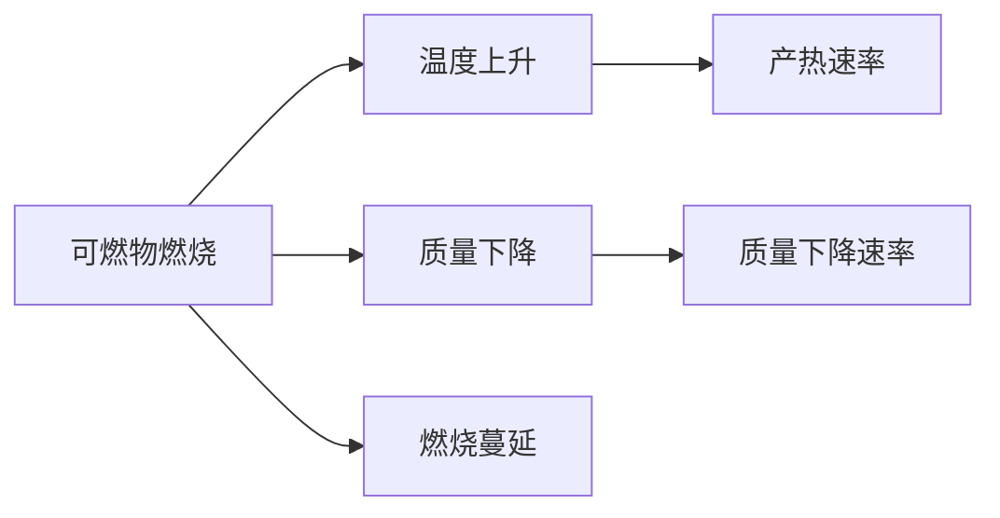

# 高层建筑火灾中风向与火源位置对于火灾蔓延规律的仿真研究

**关键字**：高层建筑火灾，网格模型，图论，计算机仿真

拟解决问题：通过计算机仿真计算不同风向和不同火源位置对与火灾蔓延的影响规律。

## 条件假设

1. 为便于仿真，假设每个房间具有相同的尺寸、相同的火灾荷载、相同的通风面积。
2. 相邻房间之间能够相互影响，相互影响的关系和概率取决于房间的相对位置以及风向。
3. 门窗等会因火焰的持续加热作用而破坏
4. 房间的墙壁也会因为火灾而烧坏，但需长时间大功率的火源加热。
5. 每个房间在火灾发生时供氧充足。

## 建构虚拟房间

对于计算机仿真而言，最为重要的是构建目标的数字模型，在此体现为真实房间的虚拟化。由于每个房间具有相同的尺寸，在此将一套房间虚拟为尺寸长宽高分别为$15\mathrm{m}\times8\mathrm{m}\times3\mathrm{m}$的房间单元。每个房间具有相同的单元属性

## 演化规则

### 初始条件

基于物质守恒与能量守恒，设每个房间的火灾荷载为m，

房间温度与环境温度一致，初始热释放速率为0。

每个房间具有唯一坐标，房间之间的坐标之间的相互关系是影响火灾蔓延传播的关键因素，通过创建一个字典存储所有房间，key为location，value为单个房间的实例。

> 需要找到的关系，火灾热释放速率，热释放过程中的温度变化情况，房间物质中的燃点情况，烟气的累积情况。

这些问题都需要一一解决，通过解决这些问题则可以开发出一款模拟软件。将其与监测监控系统结合不断修正模型，则可以进行预警和预先控制。

#### 热释放速率模型

热释放速率表征了可燃物燃烧时热能释放的随时间变化的速率，能够反映出可燃物的燃烧状态和燃烧程度，该参数主要与燃烧类型和参与燃烧的表面积有关，*燃烧类型主要分为完全燃烧和不完全燃烧，阴燃和轰燃*，在可燃物质量一定和相同燃烧 类型的情况下，可燃物参与燃烧的表面积越大，则热释放速率也越大。同时，燃烧过程随时间消耗着可燃物的质量，可燃物质量的减少导致其表面积减少，从而导致热释放速率的降低，在一些固体混合物质中，有部分物质为不可燃基质，通常称其为灰分，也有部分可燃物燃烧后的生成物能够阻碍燃烧过程造成燃烧速率的下降。综合以上因素，质量一定的可燃物燃烧热释放速率呈现出上后下的两个阶段过程。

预测模型采用一维形式的高斯函数[^1] 
$$
G_{x}=ae^{-\frac{(x-b)^2}{2c^2}}
$$

> 高斯函数的一维图是特征对称钟形曲线，a 是曲线峰值，b 是峰值的 坐标，c 为标准方差有时也称均方根可表征钟状 线的宽度，如下图所示为 给定参数时的高斯曲线

总热释放量的与参与燃烧的可燃物的数量呈现正相关的关系，对其拟合得到

$$
\dot{Q}_{max}=1.481n^{0.837}
$$

#### 受限空间中的火灾发展

#### 质量损失速率

##### 影响高聚物燃烧速率的因素

$$
\dot{m}^″=  \frac {{\dot{Q}_F^"} +  \dot{Q}_ {E}^ {"}  - \dot {Q}_ {L}^ {"} }{L_{v}}
$$

m — 质量燃烧速率； F Q — 火焰供给热通量； E Q — 其它热源供给热通量； L Q — 热损失速率； v L — 固体分解热。

质量损失速率可由下式简单定义

[^1]: 陈沛然. 典型热塑性高聚物热释放速率预测模型研究[D/OL]. 中国计量大学, 2019[2022-06-21]. https://kns.cnki.net/kcms/detail/detail.aspx?dbcode=CMFD&dbname=CMFD202101&filename=1019260077.nh&uniplatform=NZKPT&v=Z_iDSdLP4Yk-ovW4ZxpSky1WF8eDRxfuTnA0am2TOrtbp9VF2CJFhsY-E-uZErVb.
